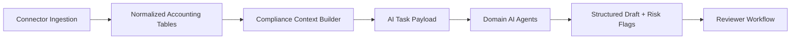

# Accounting Connectors Architecture

## Why Accounting Connectors Are Needed
AI compliance quality depends on accurate accounting inputs. Manual-only workflows create delays, inconsistency, and missing context.

Connectors provide structured data ingestion so CA Assist can:

1. Auto-populate compliance context.
2. Improve AI drafting quality.
3. Reduce repetitive data collection from clients.
4. Enable periodic sync and anomaly detection.

## Provider Strategy (Phased)

| Order | Provider Strategy | Rationale |
|---|---|---|
| 1 | Manual Upload Connector | Fastest path to value; no third-party auth dependency |
| 2 | Zoho Books OAuth Connector | Cloud-native API model and stable OAuth integration |
| 3 | Tally Local Bridge Connector | Tally is frequently on local desktop/private LAN, needs bridge |

## Why Tally Should Use a Local Bridge
Tally deployments are commonly local/on-prem and not exposed directly over secure public APIs. A local bridge pattern is safer and more practical.

Recommended bridge properties:

- Runs on client-controlled machine/network.
- Pulls Tally data locally and publishes normalized payloads to CA Assist.
- Uses signed tokens and short-lived sessions.
- Supports offline retry/buffer model.

## Why Zoho Books Can Use Direct OAuth API
Zoho Books is cloud-based with mature OAuth and HTTP APIs.

Benefits:

- Standard OAuth consent model.
- Predictable API pagination/sync patterns.
- Easier tenant-scoped token lifecycle management.
- Lower local infrastructure requirements.

## Data to Normalize
All providers should map into a common CA Assist accounting model:

| Data Domain | Normalized Purpose |
|---|---|
| Ledgers | Party/tax/account classification and balances |
| Vouchers | Transaction-level accounting records |
| Sales register | Outward supply and invoicing intelligence |
| Purchase register | Input tax and expense intelligence |
| Trial balance | Period-end validation and control totals |
| Invoice lines | Item-level tax/rate/amount accuracy checks |

## Suggested Tables

### 1) `accounting_connections`
Stores connector configuration per tenant/provider.

| Column (suggested) | Notes |
|---|---|
| `id`, `tenant_id` | Identity + tenant scope |
| `provider` | `manual_upload`, `zoho_books`, `tally_bridge` |
| `status` | connected, disconnected, error |
| `auth_payload_json` | encrypted token/credential metadata |
| `last_sync_at` | latest successful sync timestamp |
| `created_at`, `updated_at` | audit timestamps |

### 2) `accounting_sync_runs`
Tracks each sync execution.

| Column (suggested) | Notes |
|---|---|
| `id`, `tenant_id`, `connection_id` | identity/scope |
| `run_type` | full, incremental, manual |
| `status` | queued, running, success, failed |
| `started_at`, `finished_at` | runtime window |
| `records_in`, `records_out` | volume metrics |
| `error_summary` | sanitized failure details |

### 3) `accounting_ledgers`
Normalized ledger dimension records.

| Column (suggested) | Notes |
|---|---|
| `id`, `tenant_id`, `connection_id` | scope |
| `source_ledger_id` | provider-native identifier |
| `ledger_name`, `ledger_group` | business classification |
| `gstin`, `pan` | optional tax identifiers |
| `opening_balance`, `closing_balance` | numeric balances |
| `as_of_date` | snapshot period |

### 4) `accounting_vouchers`
Normalized voucher/entry records.

| Column (suggested) | Notes |
|---|---|
| `id`, `tenant_id`, `connection_id` | scope |
| `source_voucher_id` | provider-native identifier |
| `voucher_type`, `voucher_no`, `voucher_date` | voucher identity |
| `counterparty_name`, `counterparty_tax_id` | party context |
| `taxable_value`, `tax_amount`, `gross_amount` | amounts |
| `raw_payload_json` | provider payload snapshot |

### 5) `accounting_invoice_lines`
Invoice item/tax granularity.

| Column (suggested) | Notes |
|---|---|
| `id`, `tenant_id`, `voucher_id` | scope/link |
| `line_no`, `item_code`, `description` | item context |
| `qty`, `unit_rate`, `line_amount` | pricing |
| `tax_rate`, `tax_amount`, `hsn_sac` | tax precision |

## How Accounting Data Feeds AI Agents

Agent-specific usage:

- GST Agent: sales/purchase registers + invoice lines.
- TDS & Payroll Agent: voucher nature/expense patterns.
- Audit Agent: ledger anomalies + trial balance consistency.
- Income Tax Agent: income/expense trends and classification hints.

## Future Roadmap (Connector Track)

1. Define canonical accounting schema and mapping contracts.
2. Ship Manual Upload parser with validation and reconciliation checks.
3. Add Zoho OAuth connector with incremental sync watermarking.
4. Add Tally local bridge protocol and signed push/pull workflow.
5. Build connector observability dashboards and error triage views.
6. Feed normalized accounting data into AI Automation Registry routing.

## Current Implementation Note

Accounting Connector Foundation is now implemented for:

1. connection records,
2. status tracking,
3. provider guidance UI, and
4. sync-run history surface (read-only foundation).

Live sync is not implemented in this phase.

Next recommended step: Manual Upload Connector.

## Manual Upload Connector (Current)

Manual Upload connector now supports:

1. secure file storage for accounting exports (.xlsx/.xls/.csv/.xml),
2. upload metadata tracking in `accounting_uploaded_files`, and
3. sync-run record creation for each upload event.

Parsing/import into `accounting_ledgers`, `accounting_vouchers`, and `accounting_invoice_lines` is a later phase.

## Manual Upload Parser Phase 1 (Current)

Manual Upload Parser Phase 1 now supports:

1. CSV/XLS/XLSX preview parsing,
2. normalized column detection,
3. required-column validation by upload type, and
4. preview status management (valid/rejected).

Phase 1 is preview and validation only. It does not import rows into accounting tables yet.

## Manual Upload Import Phase 2 (Current)

Manual Upload Import Phase 2 now supports preview-row ledger import into `accounting_ledgers` for:

1. `trial_balance`, and
2. `ledger_dump`.

Current Phase 2 scope:

1. import only from previews marked `valid`,
2. import only preview rows captured in Phase 1, and
3. surface imported ledger summary on connector detail.

Full-file import and import support for vouchers, sales, and purchase registers are later phases.

## Sales Register Import Phase (Current)

Sales register preview-row import is now implemented.

Current scope:

1. imports validated `sales_register` preview rows only,
2. writes outward sales rows into `accounting_vouchers` as `sales_invoice`,
3. writes item/tax detail into `accounting_invoice_lines`, and
4. keeps GST reconciliation out of scope for now.

Limitations for this phase:

1. only preview rows stored in `accounting_upload_previews.preview_rows_json` are imported,
2. full-file import will come later,
3. duplicate detection and upsert are not implemented yet, and
4. purchase register import is still out of scope.

## Purchase Register Import Phase (Current)

Purchase register preview-row import is now implemented.

Current scope:

1. imports validated `purchase_register` preview rows only,
2. writes inward purchase rows into `accounting_vouchers` as `purchase_invoice`,
3. writes item/tax detail into `accounting_invoice_lines`, and
4. keeps ITC, GSTR-2B, and GST reconciliation out of scope for now.

Limitations for this phase:

1. only preview rows stored in `accounting_upload_previews.preview_rows_json` are imported,
2. full-file import will come later,
3. duplicate detection and upsert are not implemented yet, and
4. GST reconciliation and ITC/GSTR-2B reconciliation are still future phases.

## GSTR-2B Upload + Preview Foundation (Current)

GSTR-2B upload and preview foundation is now implemented.

Current scope:

1. supports `gstr2b` uploads for CSV/XLS/XLSX files,
2. normalizes and validates the required preview columns,
3. stores preview metadata in the existing upload preview tables, and
4. allows marking previews valid or rejected without running reconciliation.

Limitations for this phase:

1. no purchase-vs-2B reconciliation yet,
2. no ITC mismatch reporting,
3. no GST working notes,
4. no GST portal download or RPA flow, and
5. no automatic matching or full-file reconciliation.

Next phase: Purchase Register vs GSTR-2B Reconciliation.

## Purchase Register vs GSTR-2B Reconciliation Phase 1 (Current)

Purchase Register vs GSTR-2B Reconciliation Phase 1 is now implemented.

Current scope:

1. uses imported purchase invoices from `accounting_vouchers` (`voucher_type = purchase_invoice`),
2. uses validated GSTR-2B preview rows from `accounting_upload_previews` (`upload_type = gstr2b`),
3. matches by supplier GSTIN + invoice number,
4. compares taxable value, tax amounts, and total values, and
5. stores reconciliation runs and row-level report results for operator review.

Limitations for this phase:

1. no AI analysis,
2. no ITC decision engine,
3. no filing or GSTR-3B computation,
4. no portal download or RPA integration, and
5. no advanced fuzzy or supplier-wise matching logic.

## GST Reconciliation Working Note (Current)

GST Reconciliation Working Note is now implemented as a review-only layer on top of completed reconciliation runs.

Current scope:

1. generates a draft working note for a completed purchase-vs-2B run,
2. summarizes matched, missing, mismatched, and review-required exceptions,
3. stores risk flags and suggested follow-up documents for reviewer action, and
4. keeps CA review mandatory before any downstream use.

Limitations for this phase:

1. no automatic ITC decision,
2. no GSTR-3B computation,
3. no filing flow,
4. no voucher modification,
5. no portal or RPA execution, and
6. no automatic client communication sending.

Follow-up integration in current scope:

1. suggested document requests from GST working notes can be converted into CA Assist `document_requests` after explicit user confirmation,
2. this conversion creates internal task-linked records only, and
3. no client communication (email/WhatsApp) is sent automatically.

This keeps GST reconciliation follow-up inside the existing task and document workflow.

## GST Reconciliation Review Task Integration (Current)

GST reconciliation runs can now be linked to CA Assist compliance tasks for reviewer-driven follow-up.

Current scope:

1. a reconciliation run can create a new review task or link to an existing open GST-related task,
2. run-to-task linkage is persisted for traceability, and
3. linked context is visible on both reconciliation detail and task detail screens.

Control boundaries:

1. review remains human-controlled,
2. no filing is performed,
3. no ITC decision is made, and
4. no voucher modification is performed.

## GSTR-3B Review Pack Builder (Current)

GSTR-3B Review Pack Builder is now implemented as a review-only aggregation layer for GST reconciliation data.

Current scope:

1. aggregates sales invoice totals from accounting_vouchers and accounting_invoice_lines,
2. aggregates purchase invoice totals from accounting_vouchers and accounting_invoice_lines,
3. summarizes reconciliation exceptions (matched, missing in 2B, missing in books, amount/tax mismatches),
4. includes linked task information and pending document requests,
5. references the latest GST working note if available,
6. generates a deterministic review checklist,
7. identifies risk flags based on exception counts and data availability,
8. builds a markdown review pack with all summary data and mandatory limitation text,
9. stores the pack with status lifecycle (draft, under_review, approved, archived), and
10. provides detail page for CA/staff review.

Review Pack statuses:

1. `draft`: newly created, awaiting review.
2. `under_review`: being reviewed by CA/staff.
3. `approved`: review approved (does NOT constitute filing approval).
4. `archived`: no longer active.

Review boundaries:

1. review-only aggregation (no filing),
2. no ITC final decision computation,
3. no GSTR-3B portal upload,
4. no voucher modification,
5. no Paperclip/AI dispatch, and
6. no automatic approval of return.

Mandatory limitation text in pack:

> This review pack is not a GST return and does not constitute filing approval. CA review and portal verification are required before GSTR-3B filing.

## GSTR-3B Review Pack Register (Current)

GSTR-3B Review Pack Register is now implemented as a central list/filter view of all review packs across clients.

Current scope:

1. lists all GSTR-3B review packs across clients and time periods,
2. filters by client, status, period, and free-text search,
3. displays summary KPIs (total packs, draft, under-review, approved, archived, this month, high-risk, pending documents),
4. shows pack details including sales/purchase summaries, exception counts, risk flags, and pending document counts,
5. links to pack detail for full review and status update,
6. links to related reconciliation run,
7. links to linked review task if available,
8. provides empty state guidance for no packs, and
9. integrates into GST navigation sidebar and dashboard quick actions.

Register boundaries:

1. review-only listing and filtering,
2. no pack creation (done from reconciliation runs only),
3. no filing action,
4. no ITC decision,
5. no voucher modification, and
6. no Paperclip/AI dispatch.

## GST Control Room Dashboard (Current)

GST Control Room is now implemented as an operational summary page for GST reconciliation follow-up.

Current scope:

1. summarizes reconciliation runs and exception KPIs,
2. surfaces clients needing attention,
3. lists unresolved exceptions,
4. tracks linked/unlinked reconciliation runs,
5. shows pending GST review tasks, and
6. shows pending GST document requests.

Control boundaries:

1. review-only monitoring,
2. no ITC decision,
3. no filing action, and
4. no voucher modification.

## Accounting Data Viewer (Current)

Accounting Data Viewer is now implemented for imported ledgers.

Current scope:

1. read-only ledger listing and detail view,
2. filter/search by client, connection, provider, group, and closing-balance range,
3. summary views by group and client, and
4. raw imported JSON visibility for operator review.

No edit/delete actions, rollback, voucher/invoice-line viewing, or AI analysis are included in this phase.
