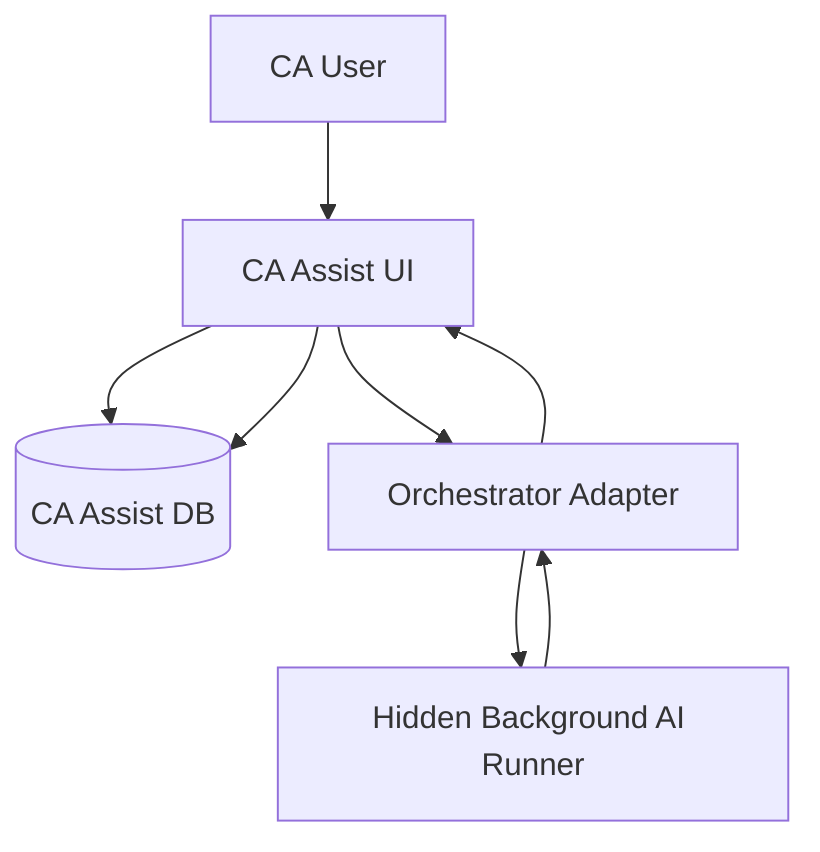
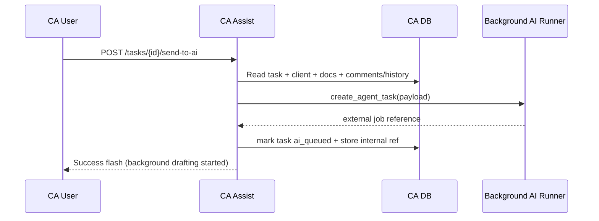
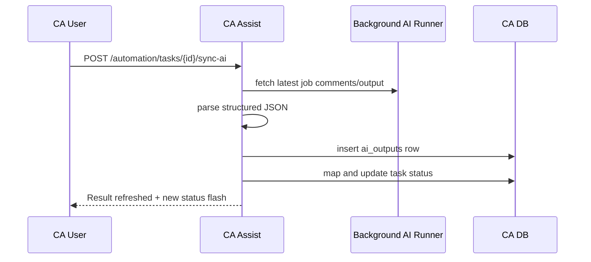

# AI Automation Architecture

## Paperclip Placement in Architecture
Paperclip is positioned as a hidden background AI orchestration layer behind CA Assist.

- CA Assist: product surface, business workflows, source-of-truth database.
- Paperclip: async AI execution runtime.
- Users interact only with CA Assist concepts (tasks, drafts, review, sync status).

## AI Automation Center Purpose
The AI Automation Center provides operational control for internal staff to:

1. Monitor AI drafting queues and failures.
2. Retry eligible failed/blocked jobs.
3. Refresh synced AI results into CA Assist.
4. Observe connection health in user-friendly language.

It is an internal visibility and control plane, not an end-client feature.

## Automation Registry Concept
Automation Registry is a planned control layer that will map:

- task type + entity context + policy
- to preferred AI agent/workflow
- with fallback and escalation behavior

Target capabilities:

| Capability | Description |
|---|---|
| Routing policy | Decide which agent handles each task type |
| Versioning | Track automation policy revisions |
| Tenant override | Allow firm-level defaults/overrides |
| Safety rules | Enforce review requirements and confidence gates |
| Observability hooks | Capture assignment and execution telemetry |

## Agent Assignment Model
Planned assignment hierarchy:

1. Task type-specific agent.
2. Domain fallback agent.
3. General review/risk agent as safety fallback.

Assignment inputs:

- `task_type`
- compliance period/FY
- client entity profile
- pending document state
- prior failure/retry counts

## Current Send to AI Flow

## Current Refresh AI Result Flow

## Structured AI Output Schema (Current)
Expected fields (normalized before persistence):

| Field | Purpose |
|---|---|
| `status_recommendation` | Suggested next business status |
| `confidence` | Confidence level (`low`/`medium`/`high`) |
| `missing_inputs` | Required unresolved inputs/documents |
| `risk_flags` | Risk indicators for reviewer attention |
| `applicable_laws` | Compliance/legal references |
| `document_requests` | Suggested document checklist items |
| `client_message_draft` | Client-ready explanatory draft |
| `internal_working_note` | Internal operator note |
| `final_output_markdown` | Rich AI draft output |

## Human Review Requirement
AI output is assistive, not final authority.

Mandatory control principles:

1. Reviewer/manager decision gates before compliance finalization.
2. High-risk/low-confidence outputs require stronger scrutiny.
3. Status transitions must remain policy-driven in CA Assist.
4. Review actions must be auditable.

## GST Reconciliation Working Note Automation (Current)

GST Reconciliation Working Note is implemented as deterministic, rule-based AI-support automation for internal review.

Current behavior:

1. reads completed purchase-vs-2B reconciliation runs and row-level exceptions,
2. builds a draft working note with risk flags and suggested document requests,
3. stores note versions with status lifecycle (draft, under_review, approved, archived), and
4. records audit events for note creation and status changes.

Guardrails in this phase:

1. no automatic ITC decision,
2. no GSTR-3B computation,
3. no filing action,
4. no voucher modification,
5. no client communication sending, and
6. no direct exposure of Paperclip internals.

Future enhancement: optional LLM-assisted narrative refinement can be introduced later behind the same review gates.

## Never Expose to CA Users
The following must remain internal:

- Raw Paperclip identifiers (issue/job IDs)
- Paperclip provider internals and transport payloads
- API keys/secrets
- Internal orchestration wiring details
- Debug-only traces unless explicitly in internal support context

## Future Agent List

| Agent | Scope |
|---|---|
| GST Agent | GST returns, reconciliations, mismatch analysis |
| TDS & Payroll Agent | TDS computation/checks and payroll compliance assistance |
| Income Tax Agent | ITR drafting, deduction checks, schedule-level assistance |
| ROC & MCA Agent | MCA filing assistance (AOC-4, MGT-7, etc.) |
| Audit Agent | Working paper support, audit observations, anomaly assistance |
| Document Checklist Agent | Context-aware checklist creation and follow-up suggestions |
| Client Communication Agent | Client-facing draft communication and explanation support |
| Review & Risk Agent | Escalation logic, risk scoring, reviewer briefing |
| Compliance Calendar Agent | Due-date intelligence and proactive reminders |
| Reconciliation Agent | Cross-source ledger/register reconciliation support |

## Operational / RPA Agents

The registry now includes operational agent classes that support portal workflows without exposing orchestration internals to end users.

| Agent | Scope |
|---|---|
| Credential & Access Agent | Access readiness checks, missing-credential detection, expiry alerts |
| GST Portal RPA Agent | GST portal pre-flight checks, 2B/challan retrieval workflow tracking |
| Income Tax Portal RPA Agent | Income Tax portal pre-flight checks, AIS/26AS retrieval workflow tracking |
| MCA Portal RPA Agent | MCA portal pre-flight checks, master/challan workflow tracking |
| TRACES RPA Agent | TRACES workflow tracking for Form 16 related operations |
| PF/ESI Portal RPA Agent | PF/ESI challan and compliance status workflow tracking |
| Portal Status Monitor Agent | Cross-portal status checkpoints and progression visibility |
| Error Resolution Agent | Human-readable interpretation of portal/system error outcomes |

## Credential & Access Agent Security Model

Security and privacy controls for credential-related automation are strict by design:

1. Registry-only behavior in this phase: no vault implementation and no login execution.
2. Credential-related automations operate on readiness metadata, never raw secrets.
3. Passwords, OTPs, and token material are not stored in AI payloads or model outputs.
4. Human review gates remain mandatory for high-risk access-readiness outcomes.

## Company Incorporation and Registration Agents

New business setup coverage extends beyond recurring tax filing workflows:

- Company Incorporation Agent and LLP Incorporation Agent for incorporation checklists.
- GST Registration Agent for GST onboarding readiness.
- MSME / Udyam Agent and Startup India Agent for startup enablement workflows.
- Shops & Establishment Agent, Labour Registration Agent, FEMA / FDI Agent, and Business License Agent for registration/license coverage.

These automations are checklist/risk oriented in the current phase and do not execute filings autonomously.

## Evidence Management Agents

Evidence Management automations focus on audit-safe packaging and traceability:

- GST/Income Tax/MCA acknowledgement capture.
- Challan receipt capture and task mapping.
- Filing evidence pack builder for reviewer-ready proof bundles.

All evidence outputs remain subject to CA Assist reviewer verification.

## Security Rules for Credentials and Portal Automation

1. AI must never see raw passwords.
2. CA Assist must not expose passwords or secret values in prompts, logs, or registry UI.
3. Portal automation in future phases must use an encrypted credential vault and audited runtime access controls.
4. Any credential-access event must be auditable and tenant-scoped.

## Credential Vault Foundation (Current Phase)

This phase introduces a credential metadata vault foundation inside CA Assist for portal access tracking only.

Current behavior:

1. Tenant-scoped credential records with audit logging for create/status/verification actions.
2. No raw password display after save.
3. No credential payload propagation to AI orchestration.
4. No portal login execution, OTP handling, or RPA runtime actions.

Implementation note:

- Until encryption keys are configured, secret storage uses a non-secret placeholder marker to prevent raw credential persistence.

## Portal Access Buttons vs Auto Login

Current Credential Vault behavior supports safe operator actions only:

1. Open Portal: opens the official portal URL in a new browser tab.
2. Check Readiness: evaluates username/secret/status readiness and records an audit event.
3. Auto Login: explicitly disabled in this phase.

Auto Login is deferred and requires:

- encrypted vault implementation,
- audited runtime access controls, and
- a local bridge/browser extension model for controlled credential usage.

Security invariant: AI never sees raw passwords, and passwords are never sent to Paperclip.

## Portal Readiness Dashboard (Current Phase)

Portal Readiness Dashboard is a pre-RPA safety layer for internal teams.

1. It provides client-wise readiness visibility for GST/Income Tax/MCA/TRACES/PF/ESI and connector portals.
2. It checks credential availability and status only (ready/partial/missing/expired/locked/error/disabled).
3. It links operators to credential records for manual remediation.
4. It does not perform login, auto-login, or credential replay.

Security invariant: no raw password exposure in UI, and no credential routing to AI/Paperclip.

## External Stat Audit Agent Integration

CA Assist will not rebuild deep statutory audit intelligence internally.

1. The user's existing Stat Audit Agent remains a separate external system.
2. CA Assist will prepare and send audit task context, client details, uploaded evidence, trial balance/ledger data, and requested audit scope to that external agent through a future connector/bridge.
3. The external Stat Audit Agent will return structured outputs to CA Assist.
4. CA Assist will persist returned outputs in `ai_outputs` (and, in future phases, related audit evidence tables where needed).
5. Human review is mandatory before any audit conclusion/finalization.

Deep statutory audit capabilities stay with the external Stat Audit Agent, including:

- materiality,
- sampling,
- CARO checklist logic,
- Schedule III checklist logic,
- SA checklist coverage,
- workpaper review, and
- statutory audit observation evaluation.
