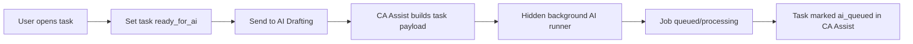
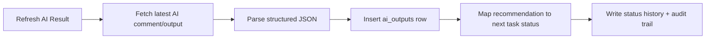
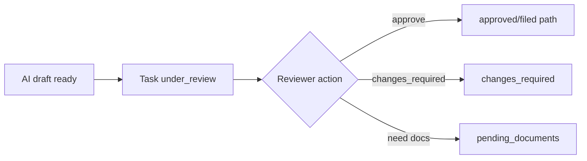

## Document Communication Drafts

CA Assist now supports internal draft generation for pending document requests. For any compliance task with pending document requests, users can generate an email draft or WhatsApp-style message draft. Drafts are stored internally, shown on the task detail page, and can be marked as reviewed or archived. Draft details can be copied (subject/body), printed, or downloaded as .txt files for manual use. No automatic sending is performed in this phase — all drafts are for internal review and manual copy/export only. No email, WhatsApp, or client portal integration is implemented at this stage.
# CA Assist Product Architecture — Current State

## Executive Summary
CA Assist is a multi-tenant SaaS platform for Chartered Accountant firms. It owns business workflows, auditability, and operational state for compliance work.

Paperclip is used only as a hidden background AI orchestration/job-runner layer. CA Assist remains the source of truth for tasks, AI outputs, review decisions, document requests, and usage metering.

The current platform (post Waves 1–12 + AI Automation QA pass) supports end-to-end compliance operations from client onboarding to AI-assisted drafting, reviewer controls, and audit-safe traceability.

## Current Module List

| Module | Purpose | Current State |
|---|---|---|
| Authentication & Tenant Model | Login/signup, tenant scope, role-aware access | Live |
| Client Master | CA firm client records and profile lifecycle | Live |
| Compliance Task Lifecycle | Status-driven task model with transitions | Live |
| Document Request Workflow | Request, track, and receive documents per task | Live |
| Document Communication Drafts | Internal email/WhatsApp draft generation for pending document requests | Live |
| Document Communication Register | Central list/filter view with copy/export/print features (no sending) | Live |
| Email Queue Foundation | Internal queue for reviewed email drafts; manual status updates only (SMTP/Gmail disabled) | Live |
| Email Provider Settings Foundation | Tenant-scoped SMTP/Gmail/Zoho metadata, masked secrets, local readiness checks only | Live |
| Queue Provider Assignment | Queue items can be mapped to active provider settings; ready-to-send remains internal only | Live |
| Email Operations Control Room | Central monitoring dashboard for draft review, queue readiness, and provider readiness (read-only, no send actions) with client/task/provider/status/date/search filters | Live |
| SMTP Dry Run Payload Preview | Ready-to-send queue items can generate local payload previews with validation (no provider connection, no send) | Live |
| Email Send Approval Gate | Dry-run previews can be approved/revoked and queue status gated as approved_to_send (internal only, no send) | Live |
| SMTP Manual Send Worker | Approved-to-send queue items with active SMTP providers can be sent via SMTP with explicit final confirmation, one email per click | Live |
| Email Delivery Logs Register | Read-only register for approved_to_send, ready_to_send, sent, and failed queue records with filters and cross-links | Live |
| SMTP Failure Review + Manual Reopen | Failed queue items can be reviewed and reopened to approved_to_send without retrying or sending | Live |
| Email Module QA Dashboard | Final read-only readiness/safety dashboard for manual SMTP operations with KPIs, risk tables, and safety checklist | Live |
| Email Readiness Checklist | Internal production-readiness gate tracking required checks before controlled client email usage | Live |
| AI Dispatch & Sync | Send task context to background AI and sync back structured results | Live |
| AI Automation Center | Internal monitoring/retry/sync UI for AI jobs | Live |
| Human Review Workflow | Review actions and approval controls before finalization | Live |
| Dashboard Control Room | Operational KPIs and work queues | Live |
| Audit Logs | Tenant-scoped activity and change trail | Live |
| Usage & Plan Limits | SaaS usage accounting and limits enforcement | Live |
| Automation Registry | Configurable agent/routing registry with tax, operational/RPA, incorporation, registration, evidence, and accounting connector mappings | Live (config-driven) |
| Jarvis Assistant (Phase 1 Foundation) | Voice/text command layer with rule-based parsing, intent preview, and confirmation-gated safe actions | Live |

## What CA Assist Owns

| Area | Ownership |
|---|---|
| Tenant and user model | Full ownership |
| Client entities | Full ownership |
| Compliance tasks and statuses | Full ownership |
| Task comments/history/review actions | Full ownership |
| Document request records | Full ownership |
| Email provider metadata and readiness state | Full ownership |
| AI output persistence (structured + raw snapshots) | Full ownership |
| Operational dashboards and automation UI | Full ownership |
| Plan limits and usage metering | Full ownership |
| Security headers, access checks, and audit logs | Full ownership |

## What Paperclip Owns

| Area | Ownership |
|---|---|
| Background AI job execution | Paperclip-owned runtime |
| Async job progression in background | Paperclip-owned runtime |
| AI comments/output payload generation | Paperclip-owned runtime |
| Internal orchestration between agents/tools | Paperclip-owned runtime |

## User-Facing Route Surface (Current)

| Route Group | Examples |
|---|---|
| Auth | `/login`, `/signup`, `/logout` |
| Dashboard & Ops | `/dashboard`, `/usage`, `/audit-logs` |
| Client Master | `/clients`, `/clients/new`, `/clients/<id>`, `/clients/<id>/edit` |
| Task Lifecycle | `/tasks`, `/tasks/new`, `/tasks/<id>`, `/tasks/<id>/edit`, status/review/doc actions |
| AI Task Actions | `/tasks/<id>/send-to-ai`, `/tasks/<id>/sync-ai` |
| AI Automation Center | `/automation`, `/automation/tasks/<id>/retry-ai`, `/automation/tasks/<id>/sync-ai` |
| Jarvis Assistant | `/voice-assistant`, `/voice-assistant/parse`, `/voice-assistant/execute` |

## Current Internal/Background Flows

### 0) Email Provider Settings Foundation
Provider settings are currently metadata-only: provider type, from-address profile, masked secret placeholder, status, default selection, and local completeness/readiness checks.

No SMTP login, Gmail API login, Zoho login, test send, or actual client email dispatch is implemented in this phase.

### 0.1) Email Queue Provider Assignment
Queued reviewed drafts can be assigned to active provider settings (SMTP/Gmail/Zoho metadata) and marked ready_to_send for future phases.

This is still internal state management only: no outbound SMTP/Gmail/Zoho send operation runs in the current phase.

### 0.2) Email Operations Control Room
Operations users now have a centralized, read-only dashboard for pipeline visibility across:
- drafts awaiting review
- reviewed drafts not queued
- queued items without provider assignment
- ready_to_send items (internal state only)
- provider readiness posture

This control room is intentionally non-dispatch: no SMTP/Gmail/Zoho send action is exposed here.

### 0.3) SMTP Dry Run Payload Preview
Ready-to-send queue items can generate and store dry-run payload previews using assigned active provider metadata and queue content.

Preview includes from/to/cc/bcc/subject/body and local validation status (ready vs incomplete) without any SMTP/Gmail/Zoho call.

### 0.4) Email Send Approval Gate
Validated dry-run previews can be manually approved for future sending and later revoked through an internal gate.

Approval transitions queue state from ready_to_send to approved_to_send, while revocation returns approved_to_send back to ready_to_send. This phase remains non-dispatch: no SMTP/Gmail/Zoho send operation is executed.

### 0.5) SMTP Manual Send Worker
Approved-to-send queue items with active SMTP provider settings can be manually sent via SMTP.

Send behavior:
- Only approved_to_send items with active SMTP providers are eligible
- Latest approval record must exist and be non-revoked
- SMTP connection uses STARTTLS (port 587) or SMTP_SSL (port 465) depending on provider config
- Send requires explicit final confirmation input (type "SEND") from operations user
- One email sent per explicit click (no bulk, no background worker, no auto-send)
- Success: status → sent, sent_at recorded, system comment added, audit log created
- Failure: status → failed, failed_at and error_message recorded, system comment added, audit log created
- Gmail, Zoho, WhatsApp, and background automation are not implemented in this phase
- SMTP password is never logged or exposed in UI

### 0.6) Email Delivery Logs Register
Operations users now have a read-only delivery register for queue records in statuses approved_to_send, ready_to_send, sent, and failed.

This register includes client/task/provider links, recipient and subject context, sent/failed timestamps, error visibility, and filter controls. No send, retry, or bulk action is available from this page.

### 0.7) SMTP Failure Review + Manual Reopen Flow
Failed queue records can now be manually reviewed and reopened after staff resolves provider/setup/draft issues.

Reopen behavior:
- Review notes are captured in failure-review metadata records.
- Reopen is allowed only when provider remains assigned and active.
- Reopen requires latest approval to still be approved and dry-run preview history to exist.
- Reopen transitions status from failed to approved_to_send and clears failed_at/error_message.
- Reopen does not send email and does not modify sent_at.
- Manual SMTP SEND confirmation remains mandatory for any later send attempt.

### 0.8) Email Module QA Dashboard
Operations users now have a final read-only QA dashboard to assess readiness and risks before manual SMTP use.

Dashboard coverage includes:
- draft and queue readiness KPIs (awaiting review, reviewed-not-queued, queued-without-provider)
- send-path operational counts (ready_to_send, approved_to_send, failed, failed-unreviewed, sent-this-month)
- provider attention list (status/readiness/from-email/SMTP completeness issues)
- failed-items-needing-review list and approved-items-pending-manual-send list
- provider failure-rate table (sent vs failed)
- explicit safety checklist status

This QA dashboard performs no dispatch operation: no send, no retry, no bulk action, and no secret exposure.

### 0.9) Email Readiness Checklist (Internal Safety Gate)
Operations users now maintain an internal readiness checklist before enabling controlled client email usage.

Readiness checklist coverage includes:
- internal SMTP provider setup and internal-only SMTP test completion
- delivery log verification and QA dashboard review completion
- failed-send review/reopen flow validation
- explicit verification that password values are not visible
- explicit verification that no bulk send and no background worker are active
- internal approval marker before client email testing

This checklist is tracking-only and does not send emails.

### 1) AI Draft Dispatch

### 2) AI Result Sync

### 3) Human Review Gate

## Database Source-of-Truth Principle

1. CA Assist database is authoritative for all business and compliance records.
2. External AI systems are treated as transient compute/orchestration layers.
3. Task state transitions are persisted in CA Assist and must remain tenant-scoped.
4. Auditability lives in CA Assist (`audit_logs`, status history, review actions).
5. Paperclip references are internal integration handles, not business identifiers.

## Completed Waves Summary

| Wave | Outcome |
|---|---|
| Wave 1 | Tenant-safe DB restructuring and core tables |
| Wave 2 | Client Master module |
| Wave 3 | Compliance task lifecycle foundations |
| Wave 4 | Task detail/actions evolution |
| Wave 5 | Structured AI output ingestion model |
| Wave 6 | AI sync flow into CA Assist DB |
| Wave 7 | Human review workflow controls |
| Wave 8 | Document request workflow |
| Wave 9 | Control Room dashboard |
| Wave 10 | Audit logs + baseline security hardening |
| Wave 11 | Plan limits + usage metering |
| Wave 12 | Regression/cleanup/production-readiness pass |
| Post-W12 QA | AI Automation Center QA fixes (invalid filter crash, confidence logic, wide layout) |

## Remaining Production TODOs

1. Production-grade process manager and WSGI deployment (replace dev server).
2. Secret/key rotation policy and environment hardening checklist.
3. Background job monitoring/alerting and retry observability.
4. Idempotent sync guards for repeated AI refresh actions.
5. Tenant-level rate controls for heavy AI and connector workloads.
6. Secure credential vault and audited runtime access controls for future portal automation.
7. Accounting connector foundation for data-enriched automations.
8. End-to-end regression suite expansion (UI and integration level).

## Registry Security Boundaries (Current)

1. Current registry phase is mapping and policy metadata only.
2. No password storage or credential-vault implementation is active in the current phase.
3. No direct portal login/RPA execution is implemented in the current phase.
4. AI payloads must never include raw passwords or secret values.

## Statutory Audit Intelligence Boundary (Current)

Statutory audit intelligence is handled through an external existing Stat Audit Agent integration path, not as a native internal CA Assist agent capability.

CA Assist currently owns audit workflow orchestration, client/task/evidence records, human review gates, audit logs, and dashboards; deep statutory audit reasoning remains external by design.
